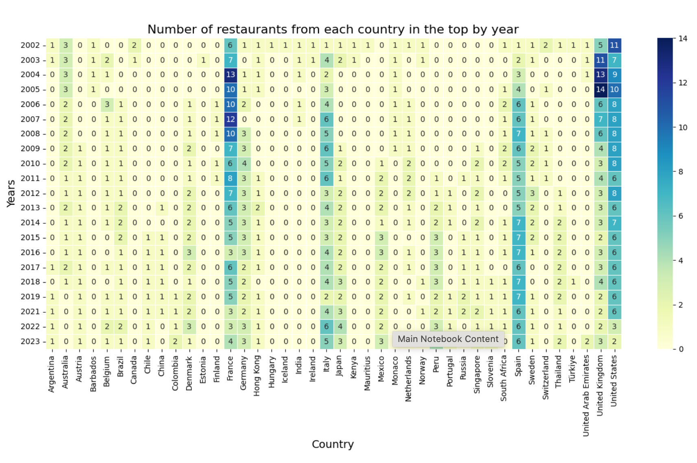

# Portfolio_Projects

This repository contains a collection of my projects, each showcasing my passion for data analysis. These projects encompass a wide range of data analysis tools and programming languages, offering a glimpse into my diverse skill set and problem-solving abilities. Each project is a unique journey, providing insightful solutions to real-world challenges.

## [Distribution and Trends of the World's Best Restaurants: Geographic and Time Analysis](https://github.com/Khabirovich/portfolio_projects/tree/main/worlds_best_rest)

This study presents a comprehensive analysis of data on the world's top restaurants, including geographic distribution, time trends and ranking dynamics. Using a variety of visualizations, we explore which countries and regions lead the global culinary industry, which restaurants have held top positions in different years, and how the overall restaurant rankings have changed over time. The analysis helps us identify key culinary centers and understand the factors that influence the success of restaurants on the global stage.

Kaggle notebook: https://www.kaggle.com/code/timurkhabirovich/geography-leadership-and-longevity

## [Analyzing factors affecting the cost of cars and predicting prices using machine learning models](https://github.com/Khabirovich/portfolio_projects/tree/main/cars_price_prediction)

This analysis examines the major factors affecting vehicle prices, including brand, model, year of manufacture, engine size, fuel type, transmission, and mileage. Visualizations are presented to show the distribution of prices and the dependence on various characteristics. Machine learning models (linear regression, decision tree and random forest) are also used to predict prices, with an evaluation of their performance and identification of the most significant features.

Kaggle notebook: https://www.kaggle.com/code/timurkhabirovich/price-gears-interactive-car-market-insights

## [The Interplay of Economy, Environment, Life Expectancy ](https://github.com/Khabirovich/portfolio_projects/tree/main/worlds_bank)

This project focuses on data visualization

Kaggle notebook: https://www.kaggle.com/code/timurkhabirovich/the-interplay-of-economy-environment-life-expct

