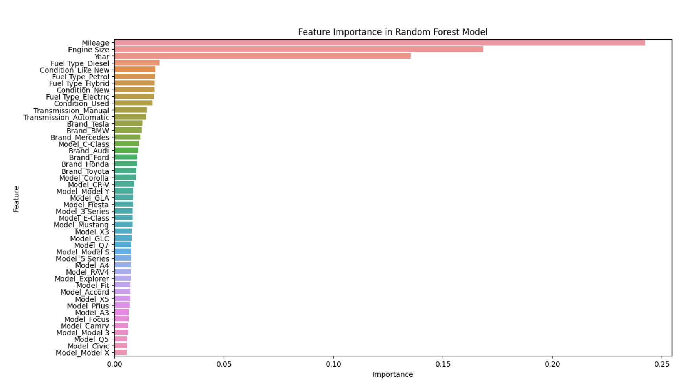

# Analyzing factors affecting the cost of cars and predicting prices using machine learning models

This analysis examines the major factors affecting vehicle prices, including brand, model, year of manufacture, engine size, fuel type, transmission, and mileage. Visualizations are presented to show the distribution of prices and the dependence on various characteristics. Machine learning models (linear regression, decision tree and random forest) are also used to predict prices, with an evaluation of their performance and identification of the most significant features.

This repository contains data used for the project, Jupiter Notebook as long as Python script. 

Additionally, you can access the complete notebook on Kaggle https://www.kaggle.com/code/timurkhabirovich/price-gears-interactive-car-market-insights

Data source: https://www.kaggle.com/datasets/zafarali27/car-price-prediction
