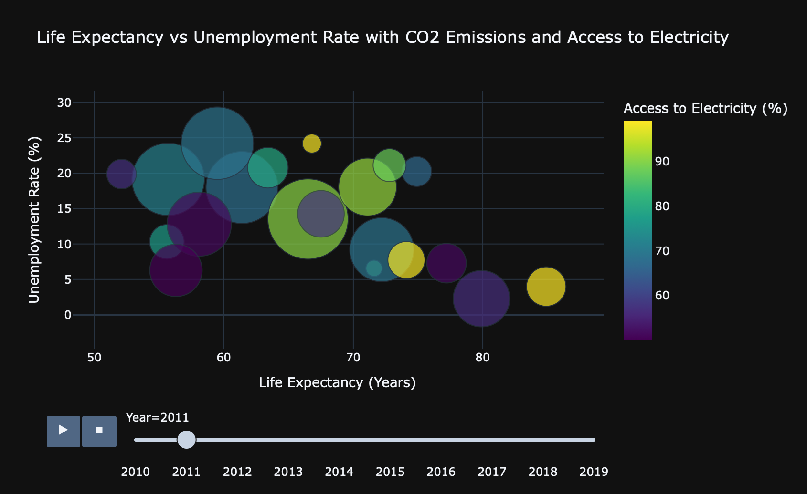

# The Interplay of Economy, Environment, Life Expectations 

This project focuses on the data visualization 

This repository contains data used for the project, Jupiter Notebook as long as Python script. 

Additionally, you can access the complete notebook on Kaggle https://www.kaggle.com/code/timurkhabirovich/the-interplay-of-economy-environment-life-expct/notebook

## About Dataset
This dataset simulates a set of key economic, social, and environmental indicators for 20 countries over the period from 2010 to 2019.
The dataset is designed to reflect typical World Bank metrics, which are used for analysis, policy-making, and forecasting. It includes the following variables:

Country Name: The country for which the data is recorded.
Year: The specific year of the observation (from 2010 to 2019).
GDP (USD): Gross Domestic Product in billions of US dollars, indicating the economic output of a country.
Population: The total population of the country in millions.
Life Expectancy (in years): The average life expectancy at birth for the country’s population.
Unemployment Rate (%): The percentage of the total labor force that is unemployed but actively seeking employment.
CO2 Emissions (metric tons per capita): The per capita carbon dioxide emissions, reflecting environmental impact.
Access to Electricity (% of population): The percentage of the population with access to electricity, representing infrastructure development.

Data source: https://www.kaggle.com/datasets/bhadramohit/world-bank-dataset
