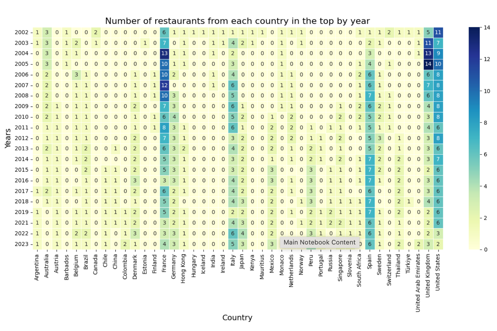

# Distribution and Trends of the World's Best Restaurants: Geographic and Time Analysis

This study presents a comprehensive analysis of data on the world's top restaurants, including geographic distribution, time trends and ranking dynamics. Using a variety of visualizations, we explore which countries and regions lead the global culinary industry, which restaurants have held top positions in different years, and how the overall restaurant rankings have changed over time. The analysis helps us identify key culinary centers and understand the factors that influence the success of restaurants on the global stage.

This repository contains data used for the project, Jupiter Notebook as long as Python script. 

Additionally, you can access the complete notebook on Kaggle https://www.kaggle.com/code/timurkhabirovich/geography-leadership-and-longevity/notebook

## About Dataset
This dataset contains the lists of World’s 50 Best Restaurants, from 2002 to 2023.

The World’s 50 Best Restaurants, established in 2002, is an annual list and awards ceremony that celebrates global culinary diversity, showcasing top restaurants and culinary trends through a voting process involving over 1,000 culinary experts from 27 regions.4

Data source: https://www.kaggle.com/datasets/thomasfranois/worlds-best-restaurants
